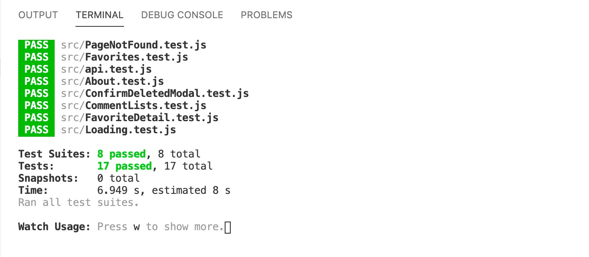

## Yingzhe Liu - ITP404 - Final Project
### [Repo link](https://github.com/YingzheLiu/myOpenFDA)
### [React frontend Netlify Deployed Link](https://nikkiliu-myopenfda.netlify.app/)
### [API Heroku Deployed Link](https://nikki-myopenfda.herokuapp.com/)
### [YouTube Link](https://usc.zoom.us/rec/share/RBWEvMgWQFKUKaL3uRDKk5xzFiYKid3wcefzYCjMavztkOGKb-vXvGswrIX0-mSn.kgdu_ddRXND5NObV)

### Application Requirements
- Client-side routing with React Router
  - At least 4 routes. (`/`,`/about`,`/favorites`,`/drug-adverseEvent`)
  - A 404 page if a user navigates to a route that doesn’t exist. (`PageNotFound.js`)
- At least one AJAX request for each of the following request types: GET, POST, PUT/PATCH, and DELETE.
- At least 1 modal (`ConfirmDeletedModal.js`)
- Custom form validation (don’t use HTML5 form validation). If a form is invalid, there should be unique error messages next to / beneath each form element. (`SearchForm.js`, `CommentForm.js`)
- At least one reusable/generic component designed by you used in at least two spots in your application. This should not be any of the components we did together in class. (`DatePickerInForm.js`)
- Each page should have a unique document title (the title in a browser tab). (`Home`,`About`,`My Favorites`, `drug-adverse event`,`Page Not Found`)
- Display notifications of some sort when a user has taken an action and it was successful, like deleting, creating, and updating something. (`SearchForm.js`,`Favorites.js`,`FavoriteDetail.js`,`About.js`)
- Use of 1 third party React library (not counting React Router). (`react-toastify`, `react-helmet`, `react-bootstrap`)

Projects will be graded based on overall complexity.
